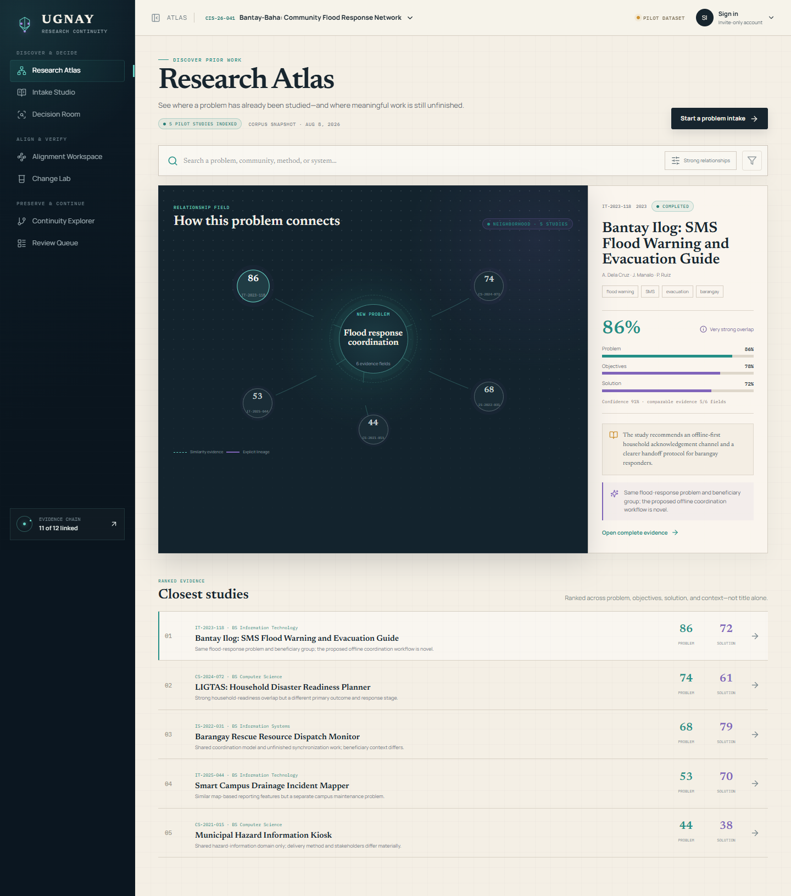

# UGNAY

**Research Continuity and Project Alignment Platform**

UGNAY connects real campus/community problems to earlier student research and preserves one explainable evidence chain:

`Problem -> Related studies -> Human route -> Objectives -> Requirements -> Features -> Tests -> Outputs -> Continuity package -> Successor`

It is a Java/MySQL web application, not a generic CRUD repository or project-management board. UGNAY recommends and explains; authorized advisers and coordinators make academic decisions.



## Run on a 4 GB Windows laptop

Requirements: 64-bit Windows 10/11, at least 3.5 GB detected RAM, a page file, 5 GB free disk, internet for the first setup, and free ports `8080` and `3307`.

No preinstalled Java, MySQL, Node, Maven, Docker, XAMPP, MinIO, or ClamAV is required.

```powershell
git clone https://github.com/Gabbu69/UGNAY.git
Set-Location UGNAY
powershell -ExecutionPolicy Bypass -File .\scripts\windows\setup-lite.ps1
```

Setup will:

- verify the machine and every downloaded SHA-256 checksum;
- install portable Java 21, MySQL 8.4 LTS, the UGNAY JAR, the generic INT8 local model, and its tokenizer under `%LOCALAPPDATA%\UGNAY`;
- request UAC only when the official Microsoft Visual C++ runtime is missing;
- bind MySQL and the web server to loopback only;
- generate separate root, application, backup, and shutdown credentials protected with Windows DPAPI;
- ask for the first administrator password;
- optionally load a clearly labelled synthetic professor-demo dataset.

After setup, use the root shortcuts:

```text
Start UGNAY.cmd
Stop UGNAY.cmd
Backup UGNAY.cmd
Update UGNAY.cmd
```

Open [http://127.0.0.1:8080](http://127.0.0.1:8080) and sign in with the email shown during setup (default `admin@ugnay.local`) and the password you created. Later starts and normal demonstrations work offline.

Runtime state is outside the replaceable clone:

```text
%LOCALAPPDATA%\UGNAY\
  runtime\   portable Java, MySQL, application, model
  data\      MySQL and private document objects
  logs\      rotating application/MySQL logs
  backups\   checksummed database + document backups
  run\       owned process identifiers
```

Useful recovery commands:

```powershell
.\scripts\windows\diagnose-ugnay.ps1
.\scripts\windows\backup-ugnay.ps1
.\scripts\windows\restore-ugnay.ps1 -BackupPath 'C:\path\to\backup' -Confirm RESTORE
```

The updater requires a clean Git checkout. It creates a backup, pulls with fast-forward only, applies Flyway migrations, starts the new build, and health-checks it. On failure it restores the prior commit, installed release pointer, database, and documents.

## Lite resource policy

- Java: `-Xms96m -Xmx512m`, Serial GC, 192 MB metaspace, one semantic inference thread.
- MySQL: 128 MB InnoDB buffer pool, 10 connections, Performance Schema and MySQL X disabled.
- Spring: Hikari 1-6, Tomcat 2-16 threads, one extraction worker and queue capacity four.
- Documents: atomic filesystem objects, randomized keys, hashes, and current-user-only Windows permissions.
- Uploads: 15 MB PDF limit, 500,000 extracted characters, bounded parsing, and Windows Defender fail-closed scanning.
- Semantics: generic INT8 `multilingual-e5-small` loads only on demand, unloads after 120 idle seconds, and falls back to explicit `PARTIAL` lexical/concept evidence when memory or inference is unavailable.
- Logs: five rotating 10 MB files.

The Compose/MinIO/ClamAV deployment remains available for a stronger pilot machine; it is not needed by Windows Lite.

## Implemented product loops

- Curator metadata/PDF ingestion with durable extraction jobs and explicit publication boundaries.
- Five-stage problem intake, persisted proposal submission, and explainable hybrid discovery.
- Separate immutable adviser recommendations and coordinator dispositions: New, Improve, Continue, return for revision, and duplicate closure.
- Continue evidence (objective-to-open-item mappings plus code/data access) and measurable Improve claims.
- Multi-project selection, explicit department/project membership, and role-scoped reads/mutations.
- Versioned trace items and typed links, requirement readiness, current test executions, immutable baseline approval, findings, coverage, scope risk, and health.
- Stable finding fingerprints with resolve, coordinator acceptance/expiry, and reopen actions.
- Typed Add/Revise/Retire/Relink change operations, impact paths, reject/return/approve decisions, evidence invalidation, and baseline N+1.
- Evidence-derived continuity readiness, successor claims, append-only outcomes, completion gates, and exactly-one source-linked catalogue publication.
- Same-origin session authentication, CSRF, concrete ETags/`If-Match`, RFC 9457 errors, and append-only audit events.

Missing information is displayed as `UNASSESSED`, `PARTIAL`, empty, or unavailable. Live API responses are never merged with frontend demo fixtures.

## Interface

UGNAY uses a connected-research-studio visual language: midnight shell, warm paper surfaces, editorial typography, teal/violet evidence paths, restrained motion, and table/matrix alternatives for graphs.

- **Research Atlas:** catalogue search and explainable research relationships.
- **Intake Studio:** problem, context, objectives, evidence, and review.
- **Decision Room:** frozen discovery evidence and all five human dispositions.
- **Alignment Workspace:** graph/matrix traceability and evidence authoring.
- **Change Lab:** persisted scope risk and blast radius.
- **Continuity Explorer:** lineage, handoff evidence, opportunities, and claims.
- **Review Queue:** role-relevant academic findings, not a task board.

Project work uses URL-scoped routes such as `/projects/:projectId/alignment`, `/projects/:projectId/changes`, `/projects/:projectId/continuity`, and `/projects/:projectId/reviews`.

## Development

Technology: Java 21, Spring Boot 4.1, Spring Security, JDBC/JPA, Flyway, Spring Modulith, MySQL 8.4, React 19, TypeScript, Vite, TanStack Query, Motion, Cytoscape.js, and ECharts. The React production build is bundled into the executable Spring JAR.

For the optional Compose development environment:

```powershell
Copy-Item .env.example .env
docker compose up -d --build
```

For host development, use Java 21 and Node:

```powershell
Set-Location frontend
npm ci
npm run dev

# second terminal
Set-Location backend
.\mvnw.cmd spring-boot:run
```

Build a same-origin release:

```powershell
$env:JAVA_HOME = 'C:\path\to\jdk-21'
.\scripts\build-release.ps1
```

## Verification

```powershell
.\scripts\verify.ps1 -InstallFrontendDependencies

Set-Location frontend
npm test -- --run
npm run lint
npm run build

Set-Location ..\backend
.\mvnw.cmd test
```

Windows scripts can be syntax-checked without executing them:

```powershell
$errors = @()
Get-ChildItem .\scripts\windows\*.ps1 | ForEach-Object {
  [void][Management.Automation.Language.Parser]::ParseFile($_.FullName, [ref]$null, [ref]$errors)
}
$errors
```

Current source verification includes frontend Vitest/lint/build, Flyway on H2 MySQL mode, Spring/Modulith tests, persistence-restart tests, security/ETag workflows, asynchronous ingestion tests, and a real 384-dimensional inference from the release INT8 model. The GitHub workflow repeats frontend/backend/OpenAPI/migration gates and publishes checksums.

Physical 4 GB/Pentium timing, the 10,000-study benchmark, real Windows Defender scanning, and full portable MySQL backup/restore must be rechecked on the actual target laptop before claiming hardware acceptance. See [acceptance and demo](docs/acceptance-and-demo.md).

## Security and limitations

- Internal authenticated catalogue; no public catalogue, SSO, OCR, mobile app, or multi-university tenancy.
- No plagiarism adjudication, thesis writing, grading, ethics review, Kanban, tasks, chat, CI execution, or Git hosting.
- Research text and embeddings remain local.
- Windows Lite fails document upload closed when Defender is unavailable; the rest of the platform remains usable.
- The INT8 model is benchmarked by observed English/Filipino results, not trusted by label alone.
- Initial setup/update requires internet; ordinary use does not.

More detail: [architecture](docs/architecture.md), [decision rules](docs/decision-rules.md), [data dictionary](docs/data-dictionary.md), [security and operations](docs/security-and-operations.md), and [OpenAPI](backend/src/main/resources/static/openapi.yaml).

## Handoff to another AI

After cloning, another coding agent should read [AGENTS.md](AGENTS.md) before editing. It records the product boundary, source-of-truth rules, project authorization, ETag requirements, UI constraints, verification commands, release process, and rules against invented live data.
