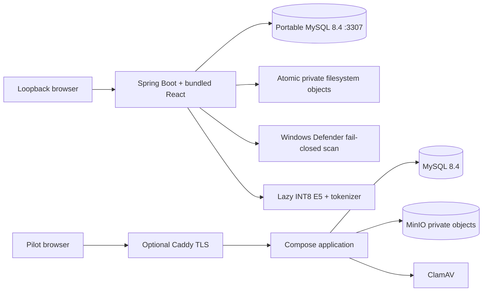

# Architecture

## System intent

UGNAY is a research-continuity and alignment system whose main invariant is a preserved, reviewable chain from a real problem to a successor project. It is not organized around tasks or generic documents. Every decision, relationship, finding, and output must answer one of three questions:

1. What prior work is materially related to this proposal?
2. Does the approved solution still trace to its original evidence and objectives?
3. Can a future team safely understand and continue the result?

## Deployment topologies

Windows Lite is the primary 4 GB distribution: setup installs checksummed portable Java/MySQL/application/model assets under `%LOCALAPPDATA%\UGNAY`; application and database bind only to loopback. The stronger-machine Compose topology remains optional. Both serve the bundled React build from Spring as one origin and use the same MySQL/Flyway evidence model.

Identity is JDBC-backed. The first application start creates the configured bootstrap administrator only when its normalized email is absent; accepted 72-hour invitations create persistent accounts with Argon2id credentials and one requested role. Sessions are stored in the Flyway-managed Spring Session tables. The React account panel supports login/logout, shows every granted role, and gives curators a compact access desk for invitations and selected-project memberships. Raw invitation-token acceptance remains an API operation. Password reset, account disablement, global role reassignment, and automated invitation delivery are not implemented.

## Modular monolith

| Module | Owns | May depend on |
|---|---|---|
| Identity and governance | accounts, roles, invitations, department policy | audit |
| Catalogue and ingestion | studies, authors, files, extraction, publication | identity, audit |
| Intake and review | problem cases, evidence, proposals, objectives | catalogue, identity |
| Discovery | frozen runs, candidates, field evidence, algorithm versions | catalogue, intake |
| Decisions | adviser recommendations and coordinator dispositions | discovery, intake, audit |
| Traceability | projects, revisions, baselines, typed links | decisions, identity |
| Verification | test cases, executions, evidence currency, coverage | traceability |
| Scope and change | findings, risk snapshots, change requests, impact paths | traceability, verification |
| Completion and continuity | handoff packages, continuation items, lineage and claims | all project evidence modules |
| Analytics and audit | append-only events, health snapshots, review queues | module events only |

Repositories remain package-private to their owning module. Cross-module operations use application services or transactional domain events. A module boundary test must fail if, for example, discovery reaches directly into a traceability repository.

## Primary request flows

### Import and discovery

1. A curator opens the Catalogue Ingestion Studio from **Ingest research** in the Research Atlas, then submits one reviewed study-metadata record to `POST /api/v1/imports/studies` or uploads a PDF to `POST /api/v1/imports/documents`. CSV batch parsing and automatic PDF-to-metadata pairing are deferred.
2. The PDF request validates size, signature, MIME type, permissions, and metadata. Windows Lite requires a clean Defender result; Compose requires a clean ClamAV result.
3. The application creates restricted document/version/extraction rows in durable `VALIDATING` state before attempting profile-specific private storage.
4. After atomic filesystem storage or MinIO confirms the object, one database transaction records the storage ETag, exposes storage state `STORED`, and changes extraction state to `QUEUED`. The API then responds `202 Accepted` with the durable job URLs; it does not wait for Tika.
5. `GET /api/v1/imports/documents/jobs/{jobId}` is the durable status source; `/events` supplies transient `text/event-stream` updates. Every document-import endpoint is curator-only, including when public synthetic-demo reads are enabled.
6. Tika extraction runs with time and character limits. Timeout or interruption cancels the parser future and shuts down its virtual-thread executor; the resulting extraction is recorded as incomplete. Queued/interrupted jobs are recovered after restart, while uncertain pre-storage work is routed to curator orphan review. Low-text documents remain reviewable but are not presented as fully indexed.
7. A curator reviews extracted evidence, authors/program/identifiers/visibility/continuation metadata, then explicitly invokes `publish-study`; publication creates the catalogue record and immutable document-version association.
8. Proposal discovery freezes the input, retrieves the bounded lexical/semantic/exact candidate union, reranks it with explained field components, and persists the result plus algorithm version.

### Decision to approved baseline

1. The engine recommends `NEW`, `IMPROVE`, `CONTINUE`, `POSSIBLE_DUPLICATE`, or `REVIEW_REQUIRED`.
2. An adviser records an evidence-based recommendation.
3. A coordinator records the authoritative disposition and rationale.
4. An approval creates the project and, for improve/continue, exactly one primary predecessor.
5. In the `/alignment` Evidence Authoring Studio, a student, adviser, or coordinator adds draft artifacts, immutable revisions, typed links, and version-bound test executions against the current project ETag.
6. Only a coordinator may approve the next baseline. Approval snapshots active trace item revisions and links; the snapshot is immutable and later work creates another baseline.

### Change analysis

1. A student proposes trace-item additions, edits, removals, or boundary changes against the current baseline.
2. Cycle-safe breadth-first traversal records each impacted item once while retaining an evidence path.
3. Tests, executions, outputs, and documents affected by changed revisions are previewed as stale.
4. The coordinator approves or returns the request. Approval creates a baseline and then applies evidence invalidation atomically.
5. Requests calculated against a superseded baseline cannot be approved without recalculation.

### Completion and future continuation

The `/continuity` Continuity Package Studio lets a student, adviser, or coordinator record repository URL and revision, setup instructions, code/data rights, structured limitations, recommendations, unfinished work, and weighted readiness evidence. The server recomputes readiness and project health rather than accepting a patched status. Only a coordinator may invoke completion. Completion evaluates Must-requirement verification, priority-weighted coverage, objective/output links, critical findings, accepted-exception validity, repository/setup evidence, rights, and structured unfinished work. Success atomically creates one catalogue study linked to the source project. A successor may claim a continuation item, but never rewrites predecessor history.

## Explainability contracts

- A similarity result stores overall and field scores, confidence, comparable fields, matched passages, input hash, model hash, weights, thresholds, and status.
- Restricted text can influence a score but its evidence response is redacted unless the viewer is authorized.
- Lexical fallback is `PARTIAL`; weights are not renormalized to simulate a complete run.
- A deterministic finding includes rule identifier/version, affected records, evidence, severity, why it matters, and valid next actions.
- Scope is `UNASSESSED` without an approved baseline. Controlled approved growth is never labelled scope creep.
- Health shows five independent dimensions, with the overall stage equal to the worst applicable dimension.

## Data and consistency

- The application workspace is reconstructed from normalized MySQL rows at startup. Synthetic records are seeded only when `UGNAY_DATASET_MODE=SYNTHETIC_DEMO` and the evidence store is empty; the default Lite choice is an empty authoritative workspace.
- Public workspace mutations run in a service transaction and write their ordered child rows through the JDBC persistence boundary. Academic approval creates its project, baseline, initial trace, lineage, health, and handoff state together; eligible completion updates the project/package and inserts the unique `studies.source_project_id` record together.
- UUID values are stored as `BINARY(16)` and exposed as canonical UUID strings.
- Mutable aggregate roots use optimistic `row_version` and HTTP ETags.
- All stored instants are UTC `DATETIME(6)`.
- Approved baselines, decisions, algorithm configurations, and audit records are append-only.
- Composite project keys prevent a link from crossing project boundaries.
- JSON is reserved for frozen configuration/evidence snapshots where queryable relational columns would not improve integrity.
- Document objects are immutable per version and addressed by randomized keys. Lite uses an atomic user-only filesystem adapter; Compose uses a bucket-scoped MinIO adapter without delete authority. SHA-256 detects accidental substitution.

## API conventions

- All business endpoints are under `/api/v1`.
- A source-controlled OpenAPI document is the interface contract and future source for a generated TypeScript client. The pilot uses a small hand-written client while Spring Boot 4.1-compatible generation tooling is evaluated.
- Validation and state conflicts use RFC 9457 problem details.
- `GET /projects/{id}` returns the canonical project `ETag`. The protected actions below require that exact value in `If-Match`; wildcard values are rejected. Missing and stale preconditions return RFC 9457 responses with status `428` and `412`, respectively. Project-authoring, baseline, continuity-evidence, and completion responses echo the current project ETag; analysis/impact clients reload the project before a later mutation. A change-request creation response carries the change request's own ETag, not a replacement project ETag.
- State transitions use actions (`approve`, `return-for-revision`, `preview-impact`, `complete`) instead of arbitrary status patches.
- Extraction progress may use server-sent events, while the MySQL job row and status endpoint remain the durable source of truth.

### ETag-protected mutation and role matrix

All routes below are under `/api/v1`. CSRF protection also applies to every session-authenticated mutation.

| Route | Authorized role | Required `If-Match` | Response concurrency value |
|---|---|---|---|
| `POST /projects/{id}/trace-items` | Student, Adviser, Coordinator | Project ETag | Current project ETag |
| `POST /projects/{id}/trace-items/{itemId}/revisions` | Student, Adviser, Coordinator | Project ETag | Current project ETag |
| `POST /projects/{id}/trace-links` | Student, Adviser, Coordinator | Project ETag | Current project ETag |
| `POST /projects/{id}/test-executions` | Student, Adviser, Coordinator | Project ETag | Current project ETag |
| `POST /projects/{id}/completion-package/evidence` | Student, Adviser, Coordinator | Project ETag | Current project ETag |
| `POST /projects/{id}/analysis-runs` | Adviser, Coordinator | Project ETag | No ETag header; reload project before another write |
| `POST /projects/{id}/baselines/approve` | Coordinator | Project ETag | Current project ETag |
| `POST /projects/{id}/complete` | Coordinator | Project ETag | Current project ETag |
| `POST /change-requests` | Student, Adviser, Coordinator | ETag of the body’s `projectId` | New change request ETag |
| `POST /change-requests/{id}/preview-impact` | Student, Adviser, Coordinator | ETag of the change request’s project | No ETag header; reload project before another write |

## Capacity assumptions

The pilot ceiling is 10,000 studies and 1,000 trace nodes in a project. Active 384-dimensional embeddings fit in application memory and remain persisted as rebuildable derived data in MySQL. This removes the operational cost of a graph or vector database. Search or graph infrastructure should be reconsidered only after measurement shows that the pilot limits or p95 targets cannot be met.
